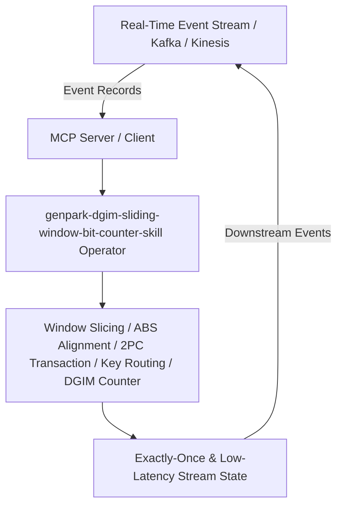

# genpark-dgim-sliding-window-bit-counter-skill

[](https://github.com/alphaparkinc/genpark-dgim-sliding-window-bit-counter-skill)
[](https://python.org)
[](#)
[](#)
[](LICENSE)

> Datar-Gionis-Indyk-Motwani (DGIM) streaming algorithm for estimating frequency and bit counts over massive sliding windows in logarithmic memory.

## Architecture Overview



## Features
- **0 External Pip Dependencies**: Pure Python standard library implementation.
- **MCP Protocol Ready**: Includes Model Context Protocol server script (`mcp_server.py`).
- **Production Standard**: Verified out-of-order event handling, stream barrier alignment, and transactional 2PC sinks.

## Quick Start
```bash
python example_usage.py
```
